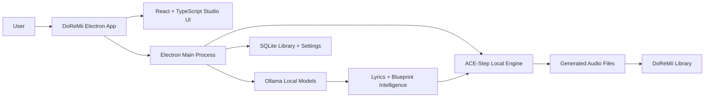

<p align="center">
  
</p>

<h1 align="center">DoReMii</h1>

<p align="center">
  <strong>A local-first desktop music studio for generating, refining, organizing, and remixing AI music.</strong>
</p>

<p align="center">
  DoReMii wraps a local ACE-Step engine with a polished Electron studio, Ollama-powered lyric intelligence,
  model controls, project history, and a growing set of creative workflows.
</p>

<p align="center">
  <a href="#quick-start"><strong>Quick Start</strong></a>
  ·
  <a href="#features"><strong>Features</strong></a>
  ·
  <a href="#architecture"><strong>Architecture</strong></a>
  ·
  <a href="#roadmap"><strong>Roadmap</strong></a>
  ·
  <a href="#development"><strong>Development</strong></a>
</p>

<p align="center">
  
  
  
  
</p>

---

## Status

DoReMii is an active private product prototype that is temporarily hosted in a public repository so development can move across machines, branches, and future release workflows.

This repository is **source-visible**, but it is **not currently open source**. No reuse, redistribution, sublicensing, or commercial rights are granted unless a license is added later.

## What It Is

DoReMii is designed to feel like a real desktop music app instead of a localhost demo page.

It starts and monitors the local music engine, gives the user a clean creative studio, generates song blueprints before audio, strengthens lyrics with local Ollama models, keeps generated music organized, and exposes advanced model controls without forcing the user into raw terminal workflows.

## Preview

<p align="center">
  
</p>

## Features

### Studio

- Native Electron desktop app with a real window, icon, launcher, and installer path.
- Clean generation studio with song name, idea, lyrics, sound/style, tags, duration, and quality controls.
- Simple, Advanced, and Pro tiers so the interface can stay friendly while still exposing deep controls.
- Duration modes for samples, loops, full songs, and auto planning.
- English-first defaults, with explicit language controls when another language is wanted.
- Prompt/style enhancement that can turn rough ideas into engine-ready captions.

### Lyrics And Blueprint Intelligence

- Blueprint-first workflow: generate and review lyrics, BPM, key, duration, caption, and metadata before audio.
- Shared Song Intent Packet keeps title, idea, style, tags, language, structure, duration, and chat context aligned.
- Ollama lyric writer support with Qwen model choices.
- Strict lyric checker for prompt match, structure, singability, rhyme/flow, hook strength, language match, repetition, and engine safety.
- Required outro for normal vocal songs.
- Off-topic drift detection so prompts like “energetic song about camping” do not silently become candy jingles or random scenes.
- Repair buttons for fixing issues, making lyrics more like the original idea, generating missing outros, rewriting choruses, cleaning stage directions, and improving singability.

### Writers' Room

- Multi-agent writing room for collaborative lyric development.
- Producer, topic guard, structure editor, hook writer, rhyme/flow checker, genre specialist, ACE lyric engine, and final editor roles.
- Lightweight room chat can use a smaller local model while stronger models handle deep lyric passes.
- Apply chat output as full lyrics, chorus, verse, bridge, outro, or a rewrite source.
- The room can minimize so the rest of the app remains usable while agents work.

### Local Models

- ACE-Step handles local music generation.
- Ollama handles local lyric writing, critique, and writers' room intelligence.
- Settings expose model roles for lyric writer, critic/deep rewrite, room chat, and ACE music engine state.
- Preferred lyric defaults currently target local Qwen models:
  - room chat: `qwen3:4b`
  - lyric writer: `qwen3:8b`
  - deep rewrite / critic: `qwen3:14b`
- ACE model controls are being expanded to make loaded versus preferred models clear.

### Library

- Generated tracks are imported into a local library instead of relying on browser downloads.
- One true output path is planned around `Music\DoReMi\Songs`.
- Track cards, procedural covers, metadata, favorites, rename, delete, and show-in-folder actions are being wired into the full library workflow.
- Persistent local SQLite storage for projects, songs, settings, and generation metadata.

### Safety And Diagnostics

- Engine manager starts, stops, restarts, and monitors ACE-Step.
- Health checks distinguish warming up, ready, stopped, and error states.
- Setup checks cover engine path, FFmpeg, CUDA, folders, model state, and writable output locations.
- Error Doctor style diagnostics are planned for model load, API, CUDA/VRAM, FFmpeg, queue, timeout, and import failures.

## Architecture



## Tech Stack

| Layer | Stack |
| --- | --- |
| Desktop shell | Electron |
| UI | React, TypeScript, Vite |
| State | Zustand |
| Local data | SQLite via `better-sqlite3` |
| Audio UI | WaveSurfer |
| Icons | Lucide React |
| Music backend | ACE-Step local API |
| Local writing models | Ollama / Qwen |
| Packaging | electron-builder |

## Quick Start

### Requirements

- Windows 10/11
- Node.js and npm
- Git
- ACE-Step installed locally
- Ollama installed for local lyric/chat models
- FFmpeg available for audio export/import workflows
- NVIDIA CUDA GPU recommended for ACE-Step

### Install

```powershell
git clone https://github.com/jaytonmack111-commits/DoREMii.git
cd DoREMii
npm install
```

### Run In Development

```powershell
npm run dev
```

### Run Electron After Build

```powershell
npm run build
npm run start:electron
```

### Package For Windows

```powershell
npm run dist
```

The packaged installer is emitted into `release/`.

## Local Engine Notes

DoReMii expects ACE-Step to be installed separately and available on the machine. The current development target is:

```text
C:\Users\Nickb\Apps\ACE-Step-1.5
```

The Electron main process manages the local ACE API in the background and watches for engine health, model initialization, and generation output.

## Recommended Local Models

Pull the current lyric/chat models with Ollama:

```powershell
ollama pull qwen3:4b
ollama pull qwen3:8b
ollama pull qwen3:14b
```

DoReMii can run with fewer models, but the intended split is:

| Role | Recommended Model | Why |
| --- | --- | --- |
| Writers' Room chat | `qwen3:4b` | Fast conversation and lightweight agent turns |
| Lyric drafting | `qwen3:8b` | Better prompt following without being too slow |
| Deep rewrite / critic | `qwen3:14b` | Stronger critique, structure, and rewrite passes |
| Music engine LM | ACE 5Hz LM | Engine-native planning and audio-token compatibility |

## Project Layout

```text
src/
  components/      Reusable UI, layout, drawers, writers' room
  lib/             Shared renderer utilities
  main/            Electron main process, engine, database, generation, model services
  pages/           Studio, Library, Settings, Explore, Labs
  preload/         Secure Electron bridge
  shared/          Shared TypeScript contracts
  stores/          Zustand app, player, studio, room, theme state
  theme/           Theme definitions
```

## Roadmap

### Near Term

- Finish ACE model selector and clearly show preferred versus actually loaded ACE models.
- Improve audio import reliability from ACE result URLs.
- Complete one true output folder behavior.
- Make library cards fully actionable: rename, favorite, delete, export, show in folder.
- Add better prompt/tag search and auto-tagging.
- Add cover-art generation pipeline.
- Add regression tests for lyric prompt adherence and structure.

### Next Studio Layer

- Song structure editor with draggable sections.
- More expressive duration planning for samples, loops, hooks, and full songs.
- Better reference audio workflows.
- Remix, repaint, extend, cover, complete, extract, and add-layer workflows.
- Project collections, albums, playlist organization, and export bundles.

### Longer Term

- DAW-style timeline.
- Stem separation and stem mixing.
- Voice/style profiles.
- Local library analysis helpers.
- Auto visualizer and cover/video workflows.
- Plugin or bridge for DAWs.
- Multi-engine backend support.
- Advanced training and LoRA workflows.

## Development

Run checks before publishing:

```powershell
npm run lint
npm run build
```

Useful commands:

```powershell
npm run dev              # Vite renderer + Electron
npm run dev:renderer     # Renderer only
npm run start:electron   # Start Electron from built output
npm run dist             # Build Windows installer
```

## Repository Notes

- `node_modules/`, `dist/`, `dist-electron/`, `release/`, logs, and runtime PID files are ignored.
- Local generated songs and ACE model files should not be committed.
- Keep secrets, tokens, private model credentials, and machine-specific `.env` files out of the repo.
- This repo is public for development portability right now, but it is not licensed as open source.

## Credits

DoReMii is built on local-first tooling and open model ecosystems:

- [Electron](https://www.electronjs.org/)
- [React](https://react.dev/)
- [Vite](https://vite.dev/)
- [Ollama](https://ollama.com/)
- [ACE-Step](https://github.com/ace-step/ACE-Step-1.5)

ACE-Step and dependency license notices should remain visible inside the app's license/about screens as the product matures.
